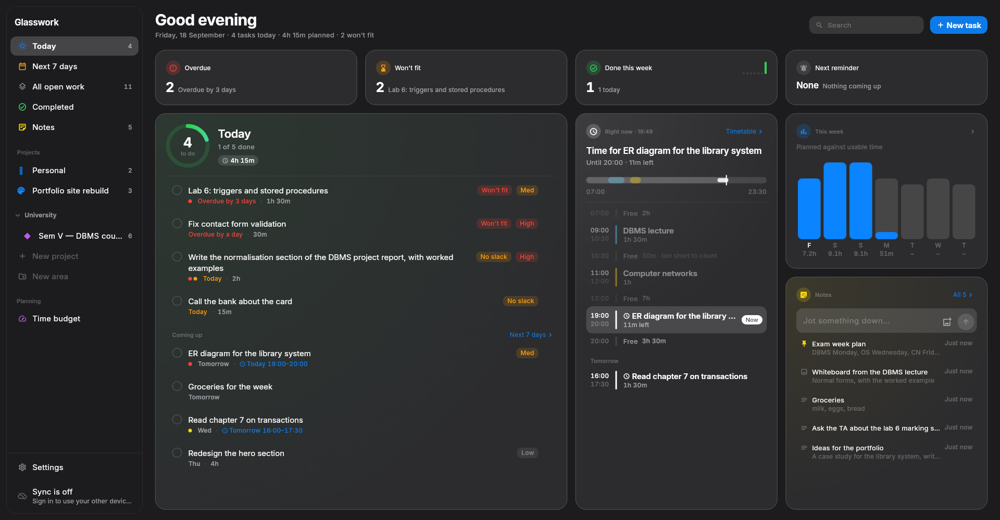
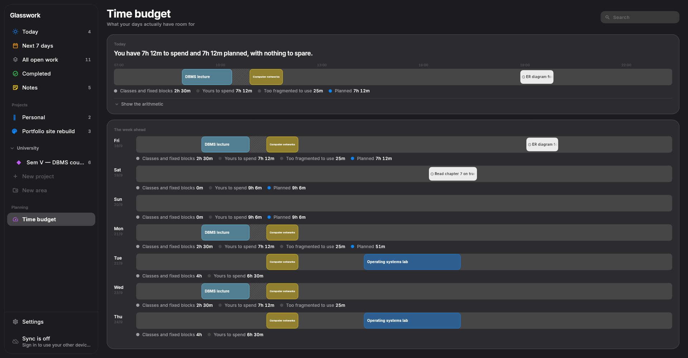
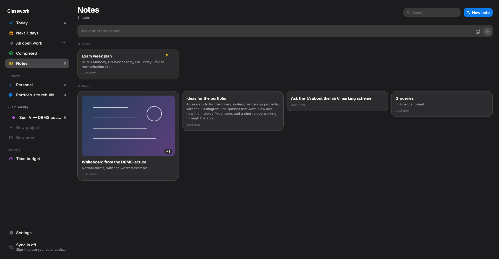

# Glasswork

A task app I wrote for myself, because every other one let me plan a week that did not fit
into the hours I actually had.



## Why I built it

I'm a student. My week is lectures, labs, coursework and a couple of side projects, and the
part I kept getting wrong was never *remembering* the work — it was believing I had time for
it. Todo apps are happy to accept "finish the report by Friday" without ever asking whether
Friday has room. Then Friday arrives and three things are due at once.

So Glasswork keeps a **time budget**. It knows when I sleep, when my classes are, and how long
my tasks take, and it works out what is actually left. When something will not fit, it says so
while I am adding it, not the night before it is due.

The other half is that it has to be there whatever I have in my hand: the same tasks on my
laptop and on my phone, and everything working with no signal at all.

## What it does

- **Today** — one screen: what is due, where the day stands right now, this week's load, and
  somewhere to jot a note. Every figure comes from a function I can point at.
- **Time budget** — your sleep, classes and fixed blocks subtracted from the day, meals and a
  buffer taken off, and what is left multiplied by a focus factor *per gap*, because six free
  hours in one block is not six hours in twenty-minute slivers. Tasks are then allocated from
  one shared pool in deadline order, so two tasks can never both claim the same Wednesday.
- **Tasks with a time** — give a task a time and it appears on the time budget for that day,
  counts in its figures, and shows up beside your classes. One field, nothing to keep in step.
- **Timetables** — a set of blocks per semester, with dates, so a horizon that crosses a
  changeover gets the right classes on each side of it.
- **Projects and areas** — boards with sections, custom fields, saved views and labels;
  projects grouped into areas you name, each with an icon or emoji of your choosing.
- **Notes** — quick notes with images, kept with the rest of your work.
- **Reminders** — exact alarms on Android; on Linux the app raises them while it is open and
  writes a systemd timer for while it is closed.
- **Sync** — optional, through a Supabase project of your own. Everything is written to the
  device first and reconciled later, so the app never waits on a network.
- **Undo** — anything destructive can be taken back for five seconds.

<p align="center">
  
  
</p>

## Install

**Linux** — download `Glasswork-Setup-<version>-x86_64` from
[Releases](../../releases), make it executable and open it:

```bash
chmod +x Glasswork-Setup-*-x86_64 && ./Glasswork-Setup-*-x86_64
```

It installs into `~/.local/opt/dev.mrhyperion.glasswork` with an app grid entry, or updates
what is already there. Nothing needs root, and your data is never touched. The same file
uninstalls it from the app entry's menu.

**Android** — download the `arm64-v8a` APK from the same release and open it. It is signed
with a debug key, so Android will ask you to allow installing from an unknown source.

Builds from Releases sync with **my** project only if you build with your own configuration —
the published binaries carry none, so out of the box they keep everything on the device.

## Building it yourself

You need Flutter 3.47 or newer, and on Linux the GTK 3 development files
(`gtk3` on Arch, `libgtk-3-dev` on Debian).

```bash
flutter pub get
flutter run -d linux            # or: flutter run -d <your phone>
```

To package the Linux installer, which builds the release app first:

```bash
linux/packaging/build_installer.sh
# → build/linux/installer/Glasswork-Setup-<version>-x86_64
```

For the phone:

```bash
flutter build apk --release --split-per-abi \
  --android-project-arg=force-version-code-ignoring-abi=true
```

Bump the version in `pubspec.yaml` **and** `AppConfig.version` for every release — a test
holds the two together, and the installer uses it to tell an update from a reinstall.

## Syncing with your own Supabase project

Skip this and the app still works; it simply keeps everything on the one device.

1. Create a project on Supabase. The free plan is enough — this is a personal app.
2. Apply the schema, which creates every table, its row level security, the realtime
   publication and the private bucket that note images live in:

   ```bash
   supabase link --project-ref <your project ref>
   supabase db push
   ```

3. Point the app at it:

   ```bash
   cp backend.example.json backend.json     # then fill in your URL and publishable key
   ```

   `backend.json` is ignored by git, and the build scripts pick it up. For a one-off run:
   `flutter run -d linux --dart-define-from-file=backend.json`.

4. Check the server agrees with the app:

   ```bash
   supabase db query --linked -f supabase/checks/sync_schema_checks.sql
   ```

   A good run ends with `ALL SYNC SCHEMA CHECKS PASSED`.

Sign in on each device with the same email and password. The first device claims the account;
the second is asked whether to combine its work with what is already there or take the
account's instead.

## How it is built

Flutter, [Drift](https://drift.simonbinder.eu) for the local database, Riverpod for state, and
Supabase for sync. The parts I would point at first:

- **Local-first is absolute.** No screen ever awaits the network. Every write hits SQLite,
  renders, and queues in an outbox for later.
- **Two clocks, never conflated.** `updated_at` is the server's, and is only a pull cursor;
  conflicts are decided by a hybrid logical clock the client stamps per field. A stale edit
  that syncs late must not beat a fresher one that synced early. Writes go through one
  `merge_rows` RPC that merges field by field — devices hold no write grants at all.
- **The capacity engine is pure Dart** — `(tasks, commitments, profile, today) -> Schedule`,
  no I/O, no clock of its own, so every number it produces is golden-tested. Numbers shown in
  the UI come from tested functions, never from arithmetic inside a widget.
- **Apple's dark palette, used honestly** — the real system colours, layered greys for depth
  rather than shadow, and every colour, space and radius from one tokens file.
- **A layout harness** renders every screen and sheet at four sizes, with realistic data, and
  fails on an overflow or on text squeezed into a column of single letters. It also writes the
  screenshots in this README.

`docs/architecture.md` is the long version, including the rules I hold myself to.

## Tests

```bash
flutter analyze
flutter test
```

Around 780 tests: the capacity arithmetic, the sync merge across two simulated devices and a
fake server, the repositories, the pure text and layout functions, and the harness above.
`supabase/checks/sync_schema_checks.sql` does the same for the server, against a real
Postgres, in a transaction that always rolls back.

## Where it stops

Linux and Android. No web, no iOS, no Windows, no teams or sharing — the schema allows other
people, the app does not ship it. Images are the only attachment. Light mode is not built,
though the palette is structured for it.

## Licence

[MIT](LICENSE). It is my own app, but take anything in here that is useful to you.
